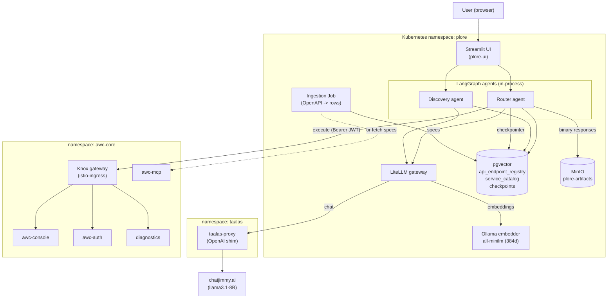
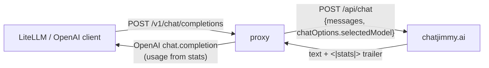
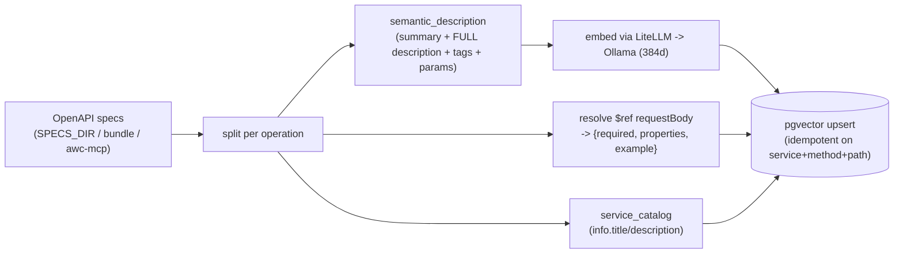
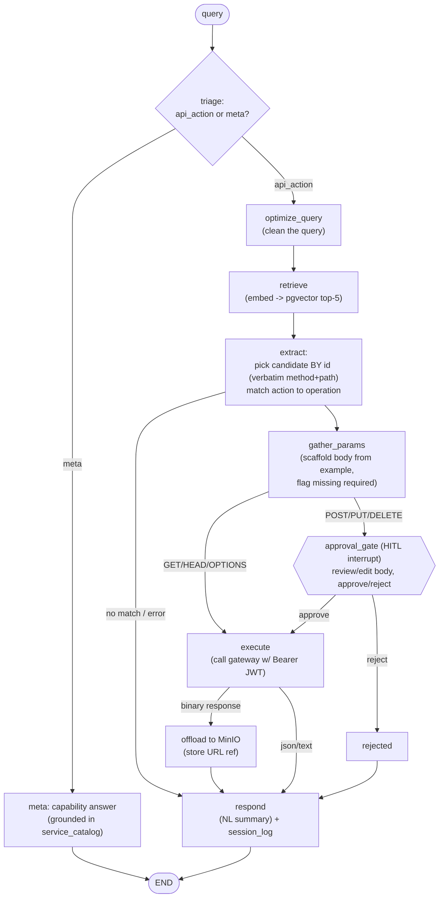
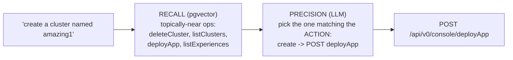
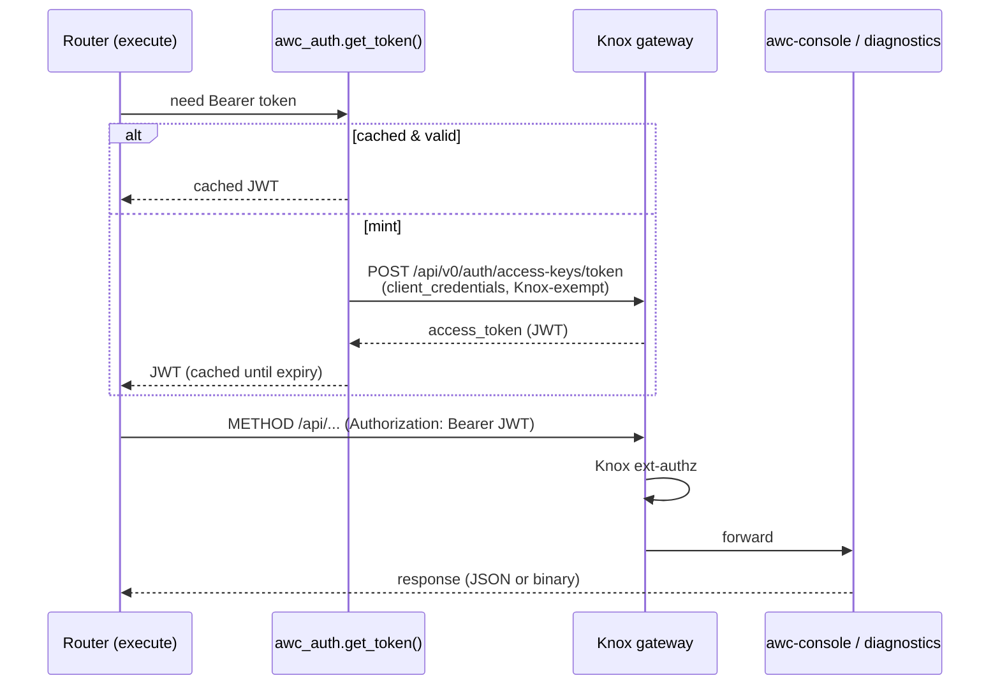
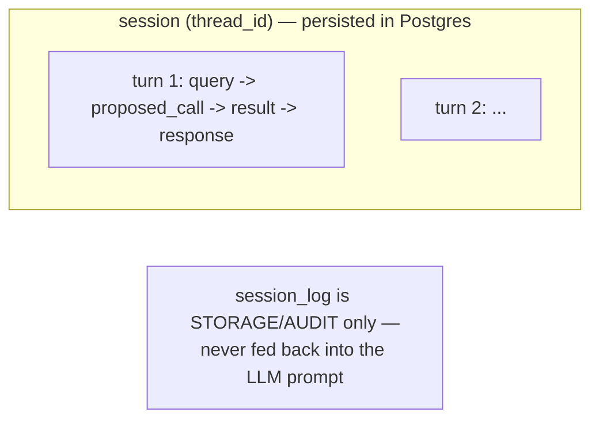
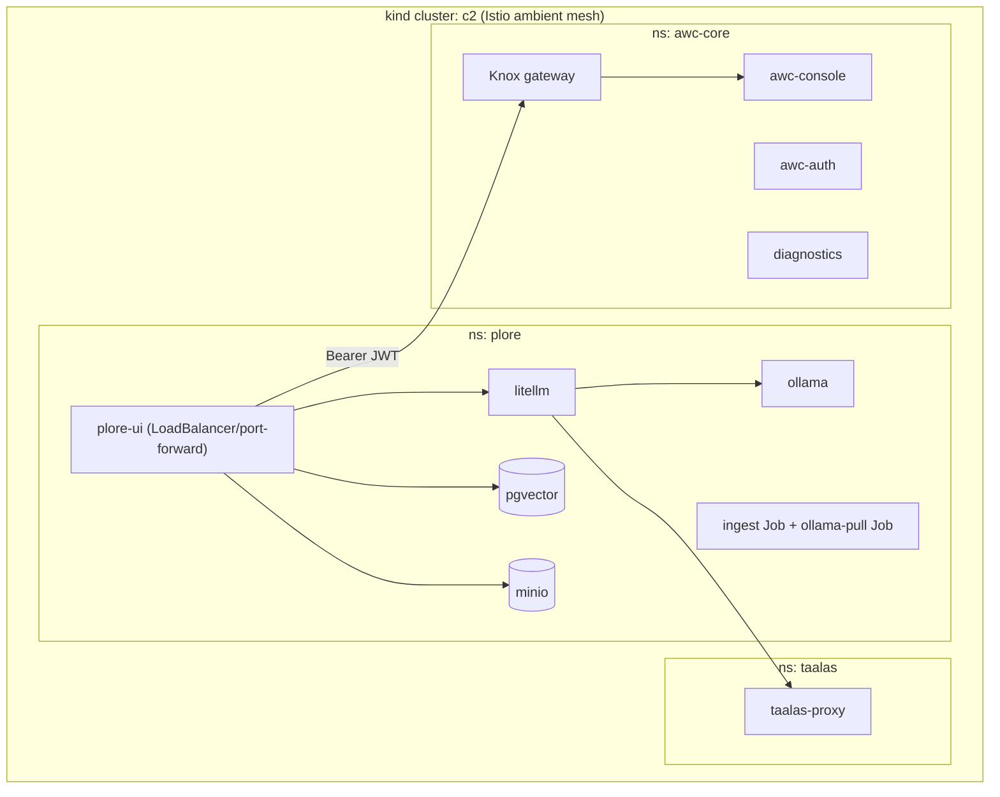

# plore — Architecture

**plore** is an intent-driven API router for the Cloudera **Anywhere Cloud (AWC)** platform.
A user asks in plain English; LangGraph agents resolve the request to the right REST operation
via semantic retrieval over a **pgvector** registry of OpenAPI operations, extract parameters,
gate mutating calls behind human approval, execute against the platform (through the AWC/Knox
gateway), offload binary artifacts to object storage, and return a processed natural-language
answer — with durable, resumable sessions.

This is **Phase I** of the MAUI agentic-platform vision (*Architecting Intent-Driven API
Routers*): a thin but complete vertical slice running in-cluster.

---

## 1. Executive summary

| Concern | Choice |
|---|---|
| Orchestration | **LangGraph** (state machine, interrupts/HITL, Postgres checkpointer) |
| LLM access | **LiteLLM** gateway — one OpenAI-compatible surface |
| Chat model | Taalas **`llama3.1-8B`** via a custom **taalas-proxy** (chatjimmy backend) |
| Embeddings | self-hosted **Ollama `all-minilm`** (384-dim) — Taalas has no embeddings API |
| Vector store | **pgvector** (operation-level registry, HNSW, cosine) |
| Execution target | AWC services via the **Knox gateway** (access-key → JWT) |
| Artifacts | **MinIO** (S3) offload, referenced in the session |
| UI | **Streamlit** (chat + HITL approval + durable session) |
| Runtime | **Kubernetes** (kind cluster `c2`), namespace `plore`, alongside `awc-core` |

Two repos:
- **[`taalas-proxy`](https://github.com/ddalton/taalas-proxy)** — Rust OpenAI-compatible proxy for the Taalas chat model.
- **[`plore`](https://github.com/ddalton/plore)** — this repo: agents, ingestion, UI, deployment.

---

## 2. Component architecture



---

## 3. The chat backend: Taalas + `taalas-proxy`

Taalas serves `llama3.1-8B` ("models cast into silicon") via the **chatjimmy.ai** web backend.
It is **not** a documented OpenAI API — it's a Next.js app whose `/api/chat` (Vercel AI SDK)
streams raw text terminated by a `<|stats|>{…}<|/stats|>` sentinel, and requires the model under
`chatOptions.selectedModel`. (The previously-documented `api.taalas.com/v1` is retired.)

**`taalas-proxy`** (Rust/axum) is a thin OpenAI-compatible shim:



- Maps `model` → `chatOptions.selectedModel`; `system` messages → `chatOptions.systemPrompt`.
- Strips the `<|stats|>` trailer; maps `prefill_tokens`/`decode_tokens` → OpenAI `usage`.
- Streaming and non-streaming; UTF-8-safe across chunk boundaries; ignores `tools` (plain chat).
- Published multi-arch image: `dilipdalton/taalas-proxy:0.1.0` (linux/amd64 + arm64).
- Stateless — no server-side sessions (each request carries full context).

---

## 4. Vector registry & ingestion

Each OpenAPI **operation** (one HTTP method + path) becomes one row. The embedded text is a
natural-language capability description (full spec description, not a truncated sentence — that
detail is what makes retrieval work). Request-body `$ref`s are resolved so the agent knows the
fields and which are required.



**`api_endpoint_registry`** (per MAUI guide §3):

```sql
project_id, microservice_name, http_method, endpoint_path,
operation_id, raw_openapi_json, body_schema (jsonb), semantic_description,
embedding VECTOR(384)   -- HNSW index, cosine
```

- `service_catalog(project_id, microservice_name, title, description)` — grounds the agent's
  capability ("what are you good at?") answers in real per-service descriptions.
- Ingestion sources: a local spec dir (`SPECS_DIR`, dev), a JSON bundle ConfigMap (cluster),
  or **awc-mcp** `get_api_specs` (`--from-mcp`, cluster-native — the spec files aren't on the
  cluster but awc-mcp serves them).

---

## 5. The Router agent (LangGraph)



Node responsibilities:

| Node | Role |
|---|---|
| `triage` | api-action vs meta/chit-chat → meta answers conversationally, never forces an endpoint |
| `optimize_query` | clean the raw query (robustly extracts the optimized string from the 8B) |
| `retrieve` | embed → pgvector top-`k` (k=5) candidate operations |
| `extract` | choose a candidate **by id** and reuse its **exact** method+path (never model-authored) |
| `gather_params` | scaffold the request body from the spec **example**, overlay known values, flag missing required |
| `approval_gate` | LangGraph **interrupt** for mutating calls; resumes with `{approved, body}` |
| `execute` | HTTP call through the gateway with a minted Bearer JWT |
| MinIO offload | binary responses → object storage; only a reference enters state |
| `respond` | LLM turns the result into a NL answer; appends to the durable `session_log` |

**Discovery agent** is a read-only subset: `optimize → retrieve → answer` ("which endpoint do I
call?"), no extraction/execution.

---

## 6. Two-stage retrieval vs. selection (the create-cluster case)

A core lesson: **recall and precision are different jobs.**



- **Recall** is semantic/topical — every "cluster" operation is near "create a cluster".
  Embedding the **full description** (which contains *"Creating a new Kubernetes cluster"* for
  `deployApp`) is what surfaces the create op; this removed an earlier curated-synonym hack.
- **Precision** (create vs list vs delete) is reasoning, not retrieval. The 8B model needs an
  explicit verb→action hint and a **concise** candidate list (full descriptions here cause
  "lost in the middle"). It lands ~3/4; the HITL gate covers the rest. A frontier model would
  be more consistent — the MAUI design assumes a frontier LLM for this stage.

---

## 7. Execution, auth, and the gateway

All AWC services sit behind a single **Knox gateway** (`console.awc-core.poc.internal`), which
path-routes `/api/v0/console`, `/api/v0/auth`, `/api/v1/diagnostics` and enforces **Knox
external-authz**. plore mints a JWT from an **access key** via the Knox-exempt token path.



- One common base URL (the gateway) + `Host: console.awc-core.poc.internal`; a pod `hostAlias`
  maps that host to the gateway ClusterIP (CoreDNS doesn't resolve `*.poc.internal`).
- `GET/HEAD/OPTIONS` auto-execute; mutating methods pass the HITL gate first.
- With `AWC_API_BASE` unset, execution is a safe **dry run**.

---

## 8. Human-in-the-loop & parameter completion

For mutating calls the graph **interrupts**. `gather_params` scaffolds the body from the spec's
`example` (so required fields are pre-filled), and the UI shows an **editable JSON body** plus any
still-missing required fields. The user edits (e.g. `clusterName`), approves, and the run resumes
with the final body. This is durable — the interrupt and state persist in Postgres.

---

## 9. Artifacts

Binary responses (e.g. a diagnostics `logs.tar.lz4` bundle) are **streamed to MinIO**, not stuffed
into graph state; the result/`session_log` keep only `{bucket, key, size, content_type, presigned
url}`. Verified end-to-end with a ~1.7 MB bundle.

---

## 10. Durable sessions & context management



- **PostgresSaver** checkpointer (reuses the pgvector DB) → sessions/threads survive pod restarts
  and replicas; the HITL interrupt resumes by **Session ID**.
- An append-only `session_log` records each turn (and is where artifact refs live).
- **No context bloat:** each query is single-shot — the prompt is built from the current query +
  retrieved schemas only; `session_log` is never replayed into the model. (Trade-off: no
  conversational memory yet; adding it would replay a *trimmed* slice, bounded for the ~6k window.)

---

## 11. Deployment (kind cluster `c2`)



- Image built locally and `kind load`ed (`plore:0.1.0`); supporting images pulled from registries.
- TEI (the originally-planned embedder) is amd64-only and wouldn't run under emulation, so the
  embedder is **Ollama `all-minilm`** (arm64-native, also 384-dim — schema unchanged).
- Manifests + deploy script: `deploy/c2/`.

---

## 12. Key decisions & findings

| Topic | Finding / decision |
|---|---|
| Taalas embeddings | None — RAG needs a **separate embedder**; taalas is generation only |
| Official Taalas API | `api.taalas.com/v1` retired → the proxy over chatjimmy is the path |
| Single gateway base | All AWC APIs path-route behind the Knox gateway by `Host` header |
| Mesh | `awc-core` & `plore` are Istio **ambient**; awc-core enforces Knox ext-authz at the waypoint |
| DNS | `console.awc-core.poc.internal` is served by **PowerDNS** via external-dns; external-dns wasn't persisting HTTPRoute records (only the TLSRoute), so records were stale — fixed manually |
| Description handling | Embed the **full** description (carried the disambiguating signal); removed a curated synonym overlay |
| 8B limits | Query-optimizer and selection are inconsistent; compensated with robust parsing, verbatim id-selection, concise candidate lists, and the HITL gate |

---

## 13. Limitations & future work

- **Selection reliability** (~3/4 with the 8B) → use a frontier model for the extraction stage,
  or clearer spec *summaries* (the MAUI "maintain metadata, not prompts" lever).
- **CrewAI** in-node squads and **Apache Polaris** governance (MAUI §7, §2) are deferred.
- **external-dns durability** — fix its PowerDNS writes so records survive cluster recreates.
- **Conversational memory** — bounded history replay (trim/summarize) within the ~6k window.
- **Auth hardening** — per-user token passthrough instead of a shared service-account key.

---

## 14. Repo layout

```
plore/
  plore/
    config.py          # env-driven config
    llm.py             # LiteLLM (chat + embeddings) client
    db.py              # pgvector: schema, upsert, top-k search, service_catalog
    semantic.py        # OpenAPI -> operations, descriptions, $ref body-schema resolution
    ingest.py          # ingestion (SPECS_DIR / bundle / --from-mcp)
    awc_auth.py        # access-key -> JWT (cached)
    artifacts.py       # MinIO offload
    checkpoint.py      # Postgres LangGraph checkpointer
    graphs/
      common.py        # shared nodes (optimize, retrieve, candidate views)
      router.py        # Agent 1 — intent-driven router
      discovery.py     # Agent 2 — read-only discovery
  ui/app.py            # Streamlit UI (HITL + durable session)
  litellm/config.yaml  # LiteLLM model routes
  db/schema.sql        # registry schema (reference; authoritative copy inlined in db.py)
  deploy/c2/           # kind manifests + deploy.sh
  docker-compose.yaml  # local stack
  Dockerfile, langgraph.json, pyproject.toml
```

## 15. Run / verify

```bash
# local
docker compose up -d pgvector ollama taalas-proxy litellm
docker compose exec ollama ollama pull all-minilm
SPECS_DIR=../awc-core/api plore-ingest
streamlit run ui/app.py            # http://localhost:8501

# c2 cluster
deploy/c2/deploy.sh
kubectl --context kind-c2 -n plore port-forward svc/plore-ui 8501:8501
```
